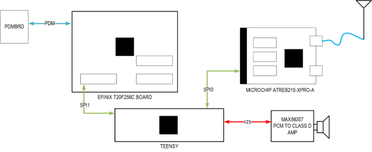
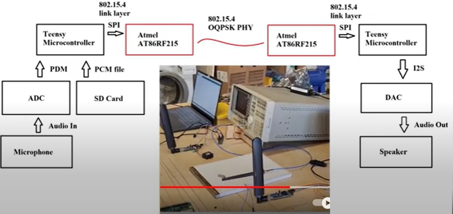
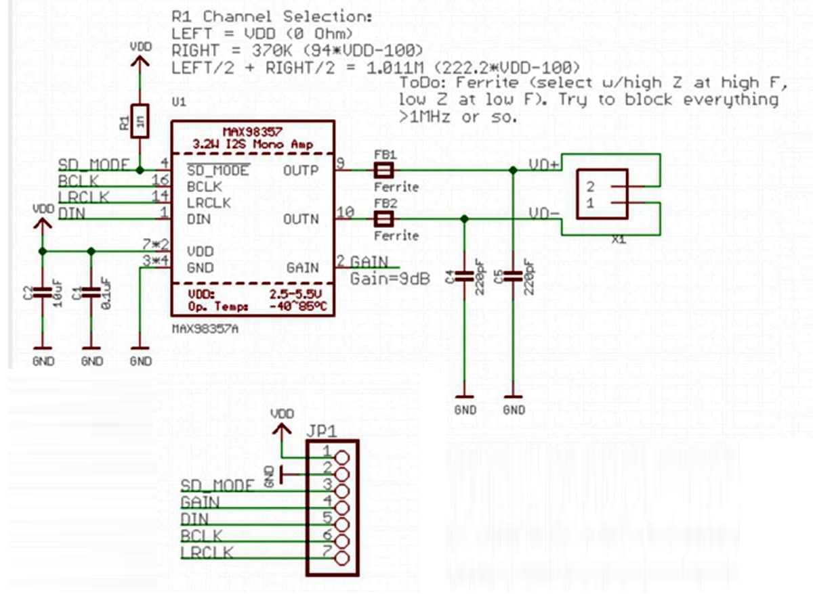

# 802.15.4 Walkie Talkie
Repo for our WES207 project, a Walkie Talkie using 802.15.4 with Opus Codec. The project is componsed of microcontrollers, RF boards, audio DACs and audio ADCs.  
  

The walkie-talkie will be composed of 3 main subsystems:  
Microcontroller: This system will be responsible for encoding/decoding audio data and implementing the non-physical layer portions of the 802.15.4 standard. The microcontroller will also be responsible for sending received audio to a speaker for output.   
RF front end: Responsible for taking the digitally modulated data generated by the FPGA, converting it into analog and transmitting it at RF. On the other end, it is also responsible for receiving bursts at RF and converting to digital samples to provide to the FPGA.  

Audio data is encoded using Skype’s Opus codec. The Opus codec is made for lossy, low data rate use cases such as what will be necessary for our project. Encoding and decoding audio data with the codec will be the main processing load of the microcontroller.  

## Demo 

## Components
Component | Model 
--- | ---
Microcontroller | Teensy 4.1
RF Front End    | Microchip REB215-XPRO
PDM Board       | FAN3852 Analog to PDM Board
Audio DAC       | MAX98357 Board

Also connect a ground between the boards.  

### Teensy to RF board
The Teensy and RF board communicate over an SPI interface.  
The RF board's pinout is described here: http://atmel-studio-doc.s3-website-us-east-1.amazonaws.com/webhelp/GUID-48EF8A2C-BED0-4DC2-B36A-38E99440A4F8-en-US-1/index.html?GUID-06EB0063-0126-41F7-B6C9-CEAB087F6BAC

Name | Teensy Pin | RF board Pin 
--- | --- | --- 
CS | 10 | 15
MISO | 12 | 17
MOSI | 11 | 16
SCK | 13 | 18
POWER | 3.3V | 19
GND | GND | 20

### Teensy to audio DAC
The Teensy and audio DAC communicate over an I2S interface.  
The DAC board's pinout is described here: 

Name | Teensy Pin | RF board Pin 
--- | --- | --- 
POWER | 5V | 1
GND | GND | 2
OUT1A | 6 | 5
BCLK1 | 21 | 6
LRCLK1 | 20 | 7

#### PDMBRD to FPGA
PDMBRD connects to Teensy.  Teensy sends PDMCLK to PDMBRD, PDMBRD sends sigma-delta modulated audio on PDAT to Teensy
see: https://github.com/jaycordaro/pdmbrd for pdmbrd
Name | Teensy Pin | PDMBRD board Pin 
--- | --- | --- 
PDAT | 5   | J6.1
PCLK | 4    | J8.1
GND  |G    | GND_TP

connect USB-micro to J2 to power PDMBRD.  J11 and J12 of PDMBRD should be jumpered.

# NEED update

## Contents in the Folders
Each foler has contents as follows.
- Presentations	: has all the presentations files presented duriong the classes.
- RF			: RF front end related documents, linkbudget calculation, related Matlab file and initioal concept related files in the archive folder.  
- audio			: audio files needed for the demo.
- images		: image files used for the readme.md.
- matlab		: Matlab files used for pre-DSP-simulation for the codes implimented in the Teensy and FPGA. 
- rtl			: FPGA codes
- standard		: 802.15.4 standard document.
- teensy        : codes for Teensy related partial tests and final demos.

## ref.) in case Efinix Trion T20256DK FPGA board is used
Component | Model 
--- | ---
FPGA            | Efinix Trion T20256DK

FPGA: Handles the heavy digital signal processing tasks, modulating and demodulating signals in accordance with the 802.15.4 PHY. The FPGA will also receive audio data from the microphone and format it in order to be sent to the microcontroller. 
### Component Connections:

#### Teensy to FPGA
The Teensy and FPGA communicate over an SPI interface:  
Name | Teensy Pin | FPGA Pin 
--- | --- | --- 
CS | 0 | 27
MISO | 1 | 28
MOSI | 26 | 30
SCK | 27 | 29  

