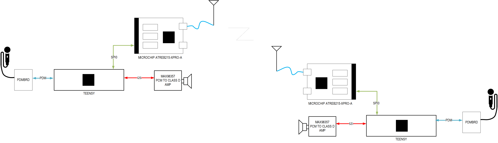

# 802.15.4 Walkie Talkie
Repo for our WES207 project, a Walkie Talkie using 802.15.4 with Opus Codec. The project is componsed of microcontrollers, RF boards, audio DACs and audio ADCs.  
  

The core of the walkie-talkie is a Teensy 4.1 microcontroller. It interfaces with an ADC and DAC to receive and transmit audio data and communicates with an RF board to relay the audio data over-the-air to other walkie-talkies.      
Audio data is encoded using Skype’s Opus codec. The Opus codec is made for lossy, low data rate use cases such as what is necessary for this project.

## Demo 

## Components
Component | Model 
--- | ---
Microcontroller | Teensy 4.1
RF Front End    | Microchip REB215-XPRO
PDM Board       | FAN3852 Analog to PDM Board
Audio DAC       | MAX98357 Board

Also connect a ground between the boards.  

### Teensy to RF board
The Teensy and RF board communicate over an SPI interface.  
The RF board's pinout is described here: http://atmel-studio-doc.s3-website-us-east-1.amazonaws.com/webhelp/GUID-48EF8A2C-BED0-4DC2-B36A-38E99440A4F8-en-US-1/index.html?GUID-06EB0063-0126-41F7-B6C9-CEAB087F6BAC

Name | Teensy Pin | RF board Pin 
--- | --- | --- 
CS | 10 | 15
MISO | 12 | 17
MOSI | 11 | 16
SCK | 13 | 18
POWER | 3.3V | 19
GND | GND | 20

### Teensy to audio DAC
The Teensy and audio DAC communicate over an I2S interface.  
The DAC board's pinout is described here: 

Name | Teensy Pin | audio DAC Pin 
--- | --- | --- 
POWER | 5V | 1
GND | GND | 2
OUT1A | 6 | 5
BCLK1 | 21 | 6
LRCLK1 | 20 | 7

### PDMBRD to Teensy
PDMBRD connects to Teensy.  Teensy sends PDMCLK to PDMBRD, PDMBRD sends sigma-delta modulated audio on PDAT to Teensy
see: https://github.com/jaycordaro/pdmbrd for pdmbrd
Name | Teensy Pin | PDMBRD board Pin 
--- | --- | --- 
PDAT | 5   | J6.1
PCLK | 4    | J8.1
GND  |G    | GND_TP

connect USB-micro to J2 to power PDMBRD.  J11 and J12 of PDMBRD should be jumpered.

## Contents in the Folders
Each foler has contents as follows.
- presentations: has all the presentations files presented duriong the classes.
- RF: RF front end related documents, linkbudget calculation, related Matlab file and initioal concept related files in the archive folder.  
- audio: Audio files needed for the demo.
- images: Image files used for the readme.md.
- matlab: Matlab files used for pre-DSP-simulation for the codes implimented in the Teensy and FPGA. 
- rtl: FPGA code
- standard: 802.15.4 standard document.
- teensy: code for Teensy-related partial tests and final demos.

## ref.) in case Efinix Trion T20256DK FPGA board is used
Component | Model 
--- | ---
FPGA            | Efinix Trion T20256DK

FPGA: Handles the heavy digital signal processing tasks, modulating and demodulating signals in accordance with the 802.15.4 PHY. The FPGA will also receive audio data from the microphone and format it in order to be sent to the microcontroller. 
### Component Connections:

#### Teensy to FPGA
The Teensy and FPGA communicate over an SPI interface:  
Name | Teensy Pin | FPGA Pin 
--- | --- | --- 
CS | 0 | 27
MISO | 1 | 28
MOSI | 26 | 30
SCK | 27 | 29  

## Quick Start
1. Connect the Microcontroller, RF Front Board, PDM Board, and Audio DAC according to the instructions in the "components" section
2. Copy the contents of the audio folder onto an SD card and insert it into the Teensy
3. Install the Arduino IDE on your PC
4. Install the Teensy plugin for the Arduino IDE: https://www.pjrc.com/teensy/td_download.html
5. Open the audio_transceiver project from the teensy folder in the IDE
6. Connect the Teensy board to the PC using a micro-USB cable
7. Select the Teensy board from the drop down menu at the top of the Aruduino IDE
8. Click the check mark button to flash the project to Teensy
9. Open the serial interface in by going to View > Serial monitor
10. Repeat the previous steps with a second set of components
11. In the serial monitor of one setup, send the "RX" command
12. In the serial monitor of the other setup, send the "TX" command and speak into the microphone connected to the PDM board.
13. After the recorded message is relayed to the other setup, the recorded audio will play automatically
