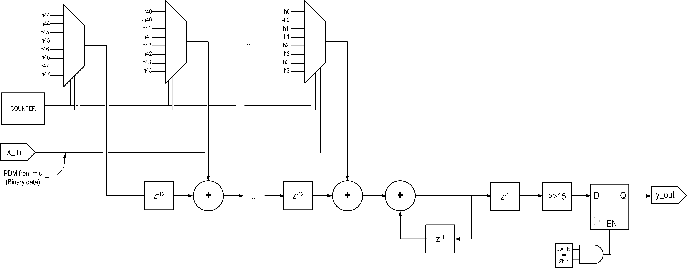

# audio_input

This directory contains SystemVerilog modules and testbenches for PDM audio decimator to PCM.  PCM samples are available over I2S controller as well as SPI.  

* hb_filter.sv - 27-tap half band filter
* polyphase_ds_decim.sv -- 48-tap polyphase decimate by 12 filter.  Uses '[fred] harris' sigma-delta decimation architecture
 
The architecture of this filter is shown above.  Since the input to the non-recursive filter is a single bit, there are no multiplies in the filter.  Compare with CIC filter.  
see https://www.youtube.com/watch?v=06XRSkkfhek and https://www.dsprelated.com/thread/5071/thd-with-cic-and-conventional-fir-filter-a-comparison-with-pdm-input-signal
