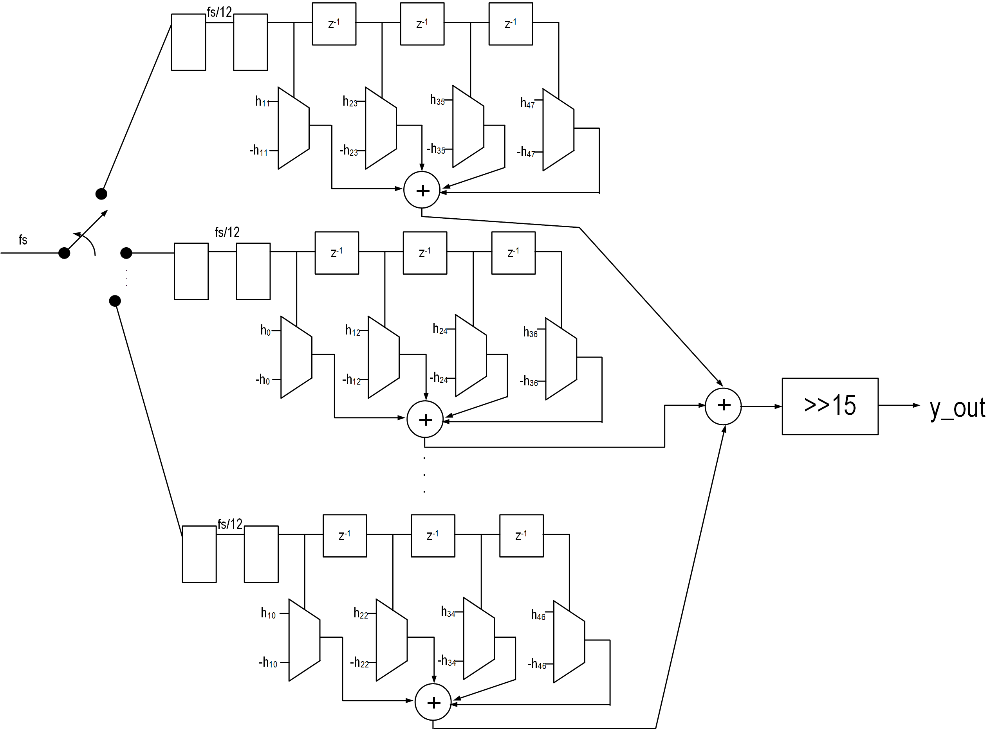

# audio_input

This directory contains SystemVerilog modules and testbenches for PDM audio decimator to PCM.  PCM samples are available over I2S controller as well as SPI.  

* hb_filter.sv - 27-tap half band filter
 
This is a standard half band filter.  Only 7 multipliers are used for 27-tap filter.  Filter taps have Q15 format. 
* polyphase_ds_decim.sv -- 48-tap polyphase decimate by 12 filter.  Uses '[fred] harris' sigma-delta decimation architecture
 
The architecture of this filter is shown above.  Only legs 0, 10, and 11 are shown (not all 12).  Since the input to this non-recursive filter is +/-1, there are no multiplies in the filter.  Muxes are used to select the tap value or its 2's complement since PDM microphones send sigma-delta modulated audio as single bit digital data instead of +/-1.  Compare this approach with the common CIC filter.  
see https://www.youtube.com/watch?v=06XRSkkfhek and https://www.dsprelated.com/thread/5071/thd-with-cic-and-conventional-fir-filter-a-comparison-with-pdm-input-signal
