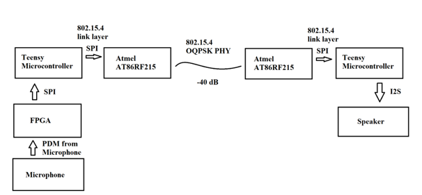

# File-based transceiver
This transceiver can be commanded through the Teensy serial interface. Sends audio through the microphone and speaker.



## Build Instructions
install the Arduino-Teensy-Codec-lib: 
```
cd  ~/Documents/Arduino/libraries
git clone https://github.com/FrankBoesing/Arduino-Teensy-Codec-lib
```