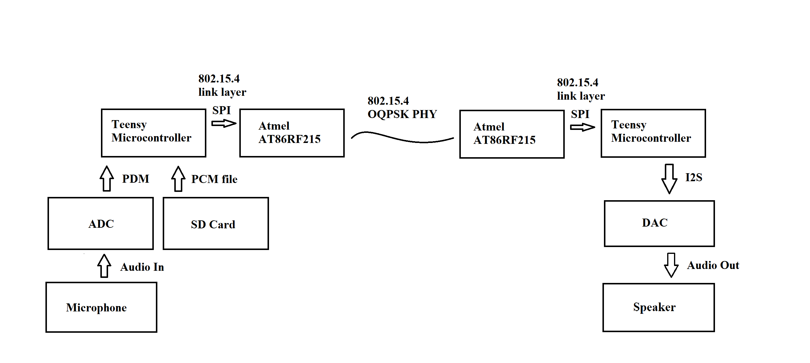

# Audio transceiver
This transceiver can be commanded through the Teensy serial interface. Sends audio through the microphone and speaker.



## Build Instructions
install the Arduino-Teensy-Codec-lib: 
```
cd  ~/Documents/Arduino/libraries
git clone https://github.com/FrankBoesing/Arduino-Teensy-Codec-lib
```
## Usage
1. Copy the contents of the audio folder onto an SD card
2. Insert SD card into Teensy
3. Flash code onto teensy with Arduino IDE if not done yet
4. Open serial monitor on Arduino IDE
5. You can then control the Teensy with the following commands:
- TX: Record audio from the microphone for 3 seconds and transmit it  
- RESEND: Retransmit the last recorded audio
- HELLO: Transmit a pre-recorded "hello" message
- BYE: Transmit a pre-recorded "goodbye" message
- OKAY: Transmit a pre-recorded "okay" message
- RX: Receive a message and play the audio out of the speaker
- STATE: Prints the Tx/Rx state of the RF board
- READ: Read a register from the RF board
- PLAY: Replay the last received message out of the speaker
- CHANNEL: Change the current channel number to transmit and recieve on
- CRC_FILTER: Toggle if packets should be dropped in there is a CRC error
- HEADER_FILTER: Toggle if packets should be dropped if the header is invalid
